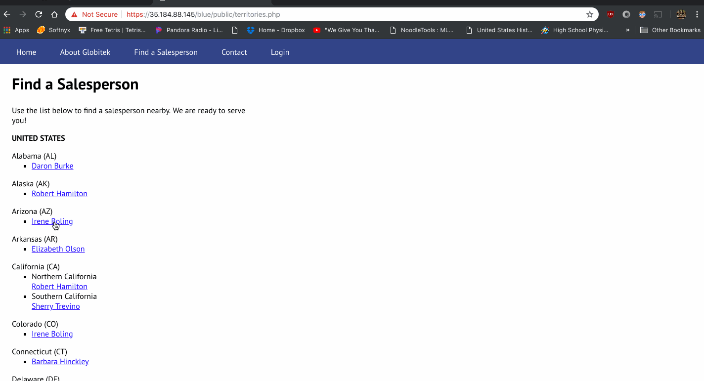
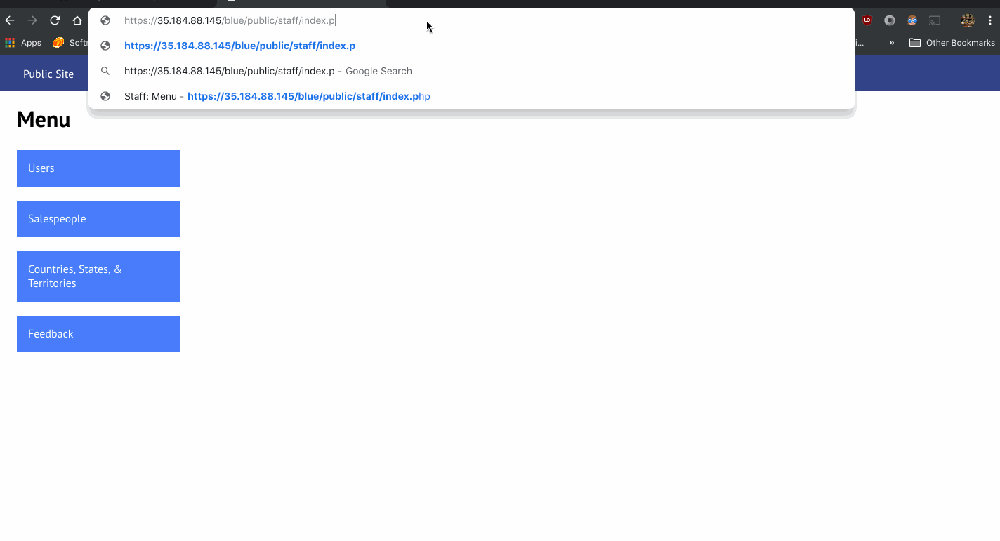

# Project 8 - Pentesting Live Targets

Time spent: **X** hours spent in total

> Objective: Identify vulnerabilities in three different versions of the Globitek website: blue, green, and red.

The six possible exploits are:

- Username Enumeration
- Insecure Direct Object Reference (IDOR)
- SQL Injection (SQLi)
- Cross-Site Scripting (XSS)
- Cross-Site Request Forgery (CSRF)
- Session Hijacking/Fixation

Each version of the site has been given two of the six vulnerabilities. (In other words, all six of the exploits should be assignable to one of the sites.)

## Blue

Vulnerability #1: SQL Injection
- GIF Walkthrough:
  
  - The SQLI vulnerability is by adding ``` ' OR SLEEP(5)=0--' ``` to the end of the URL which will cause the webpage to take 5 seconds to query the data.
  - Steps taken:
  1. Using sqlmap it gives us the vulnerability
  ```
  ' OR SLEEP(5)=0--'
  ```
  2. Insert this into the url
  3. The server will execute the SQLI and sleep for 5 seconds.

Vulnerability #2: Session Hijacking
- GIF Walkthrough:
  
  - Steps taken:
  1. Log into the Blue page with Chrome or any brower with the URL ``` https://35.184.88.145/blue/public/staff/login.php ```
  2. Go to ``` https://35.184.88.145/blue/public/hacktools/change_session_id.php ``` to obtain the session id.
  3. Open another browser, and access ``` https://35.184.88.145/blue/public/hacktools/change_session_id.php ```.
  4. Copy the session id obtained in step 2 and paste it into the blue page session id and change it.
  5. In the blue page, click login and you should be automatically logged in without entering any user credentials.

  

## Green

Vulnerability #1: ********\_\_********

Vulnerability #2: ********\_\_********

## Red

Vulnerability #1: ********\_\_********

Vulnerability #2: ********\_\_********

## Notes

Describe any challenges encountered while doing the work
