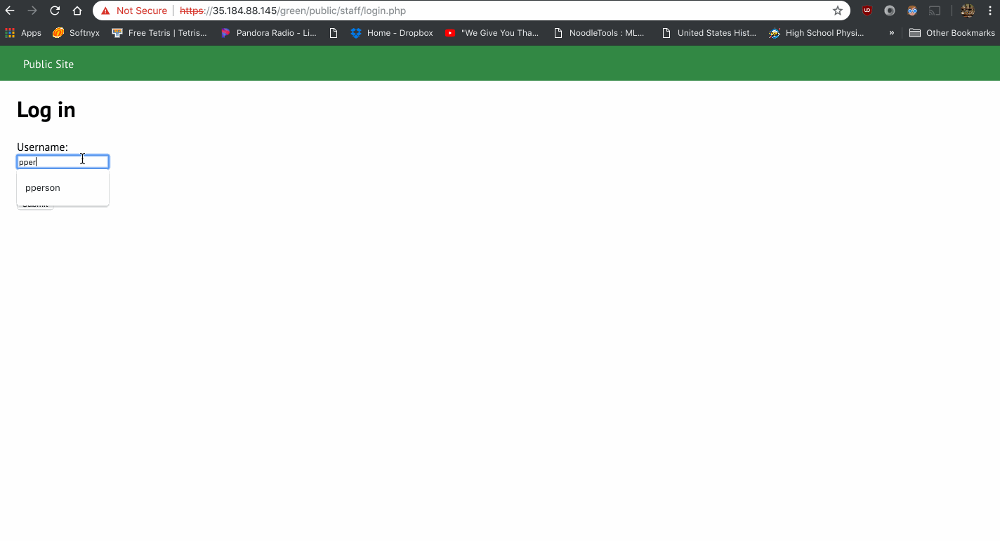
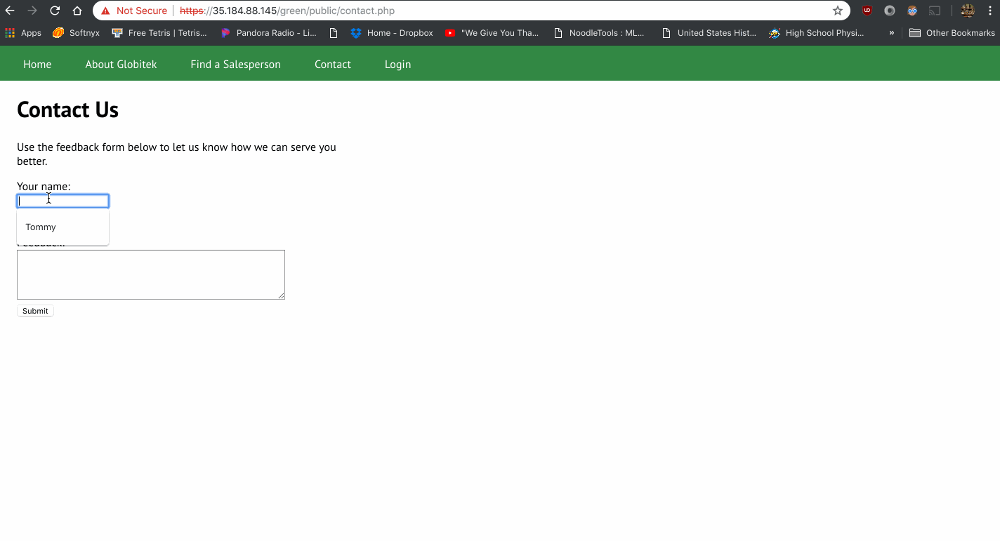
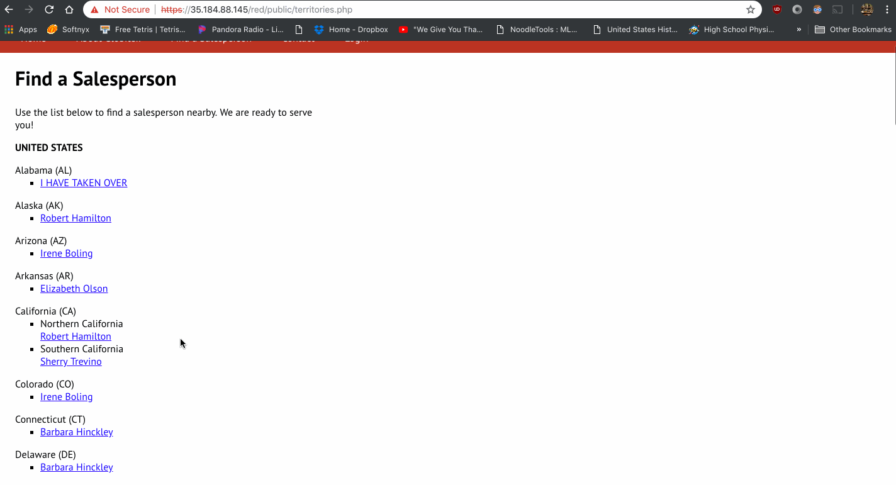
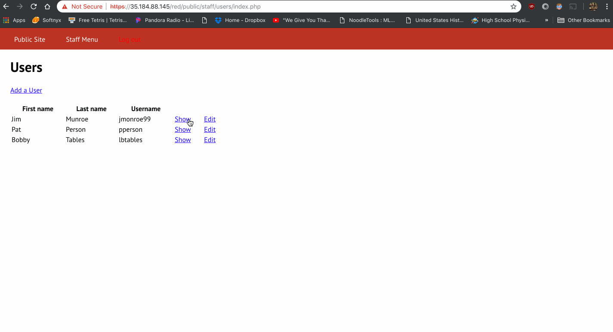

# Project 8 - Pentesting Live Targets

Time spent: **6** hours spent in total

> Objective: Identify vulnerabilities in three different versions of the Globitek website: blue, green, and red.

The six possible exploits are:

- Username Enumeration
- Insecure Direct Object Reference (IDOR)
- SQL Injection (SQLi)
- Cross-Site Scripting (XSS)
- Cross-Site Request Forgery (CSRF)
- Session Hijacking/Fixation

Each version of the site has been given two of the six vulnerabilities. (In other words, all six of the exploits should be assignable to one of the sites.)

## Blue

Vulnerability #1: SQL Injection
- GIF Walkthrough:
  
  - The SQLI vulnerability is by adding ``` ' OR SLEEP(5)=0--' ``` to the end of the URL which will cause the webpage to take 5 seconds to query the data.
  - Steps taken:
  1. Using sqlmap it gives us the vulnerability
  ```
  ' OR SLEEP(5)=0--'
  ```
  2. Insert this into the url
  3. The server will execute the SQLI and sleep for 5 seconds.

Vulnerability #2: Session Hijacking
- GIF Walkthrough:
  
  - This vulnerability allows any user to change their session id and log in without entering their user credentials.
  - Steps taken:
  1. Log into the Blue page with Chrome or any brower with the URL ``` https://35.184.88.145/blue/public/staff/login.php ```
  2. Go to ``` https://35.184.88.145/blue/public/hacktools/change_session_id.php ``` to obtain the session id.
  3. Open another browser, and access ``` https://35.184.88.145/blue/public/hacktools/change_session_id.php ```.
  4. Copy the session id obtained in step 2 and paste it into the blue page session id and change it.
  5. In the blue page, click login and you should be automatically logged in without entering any user credentials.

  

## Green

Vulnerability #1: User Enumeration
  - GIF Walkthrough:
  
  - The vulnerability here is that if a user login with a username that exist, the error message will be bold. 
    If the user login with a username that doesn't exist, the error message will not be in bold.
  - Steps taken:
  1. Click login on the green page and type ``` pperson ``` as the username and the password can be anything.
  2. You should see the message ``` Log in was unsuccessful ``` is in bold.
  3. Now, type any username like ``` Tommy ``` and the password can be anything.
  4. You should see the message ``` Log in was unsuccessful ``` is not in bold.

Vulnerability #2: Cross-Site Scripting
  - GIF Walkthrough:
  
  - The vulnerability here is a XSS exploit that uses a simple Javascript injection on the feedback input in the Contact page.
    The script will display an alert when submitting the feedback.
  - Steps taken:
  1. Click on the Contact section in the Green page.
  2. Enter in your name, email and the script ``` <script>alert('Mallory found the XSS!');</script> ``` in the feedback textbox.
  3. Submit the feedback, then click login and click on feedback and it will display the alert message.

## Red

Vulnerability #1: Insecure Direct Object Reference (IDOR)
  - GIF Walkthrough:
  
    - The vulnerability here is that any attacker can access information that is not usually available to the public by 
      changing the ``` id ``` parameter.
    - Steps takens:
    1. Click on Find a salesperson section in the Red page.
    2. Then click on anyone in there, and in the URL section start changing the id to like 5, where it will display
       the salesperson info.
    3. Then change id in the URL to 10 and you should see ``` Testy McTesterson (NOT PUBLIC UNTIL SEPT. 1) ``` 
    4. Go back to the salesperson section and try to find the person ``` Testy McTesterson ``` you won't be able to see 
       Testy there.

Vulnerability #2: Cross-Site Request Forgery (CSRF)
  - GIF Walkthrough:
  
    - The vulnerability here is an CSRF exploit that takes the url of the link manually and change the content within the file. This attack is executed through the opening of an html file that will run a script that changes the uers in a system.
    - Steps taken:
    1. Download my Cross_Site_Request_Forgery.html which contains the attack that will change the content of a user.
    2. Go to ``` Users ``` in the login tab of the Red page.
    3. Look for the person with user id 1 and look at their name.
    4. Run the Cross_Site_Request_Forgery.html file by double clicking on it, it should run in the browser.
    5. Now, go back to the login tab and click ``` Users ```, you should see the user with id 1 has been changed to a new user.

## Notes

Describe any challenges encountered while doing the work:
- No challenges encountered while doing the work.
